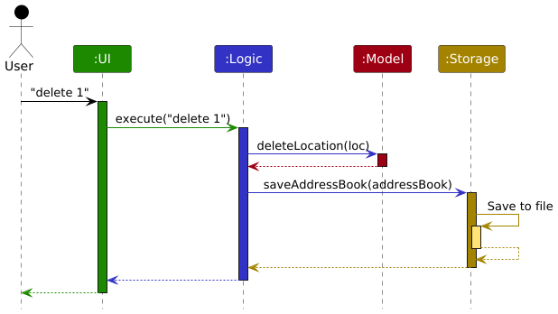
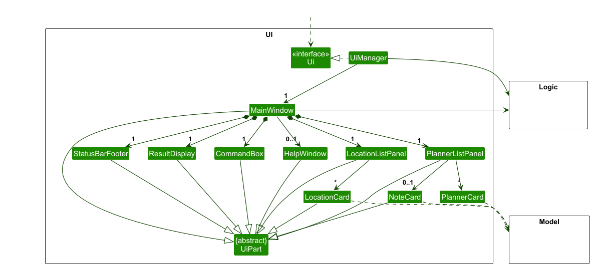
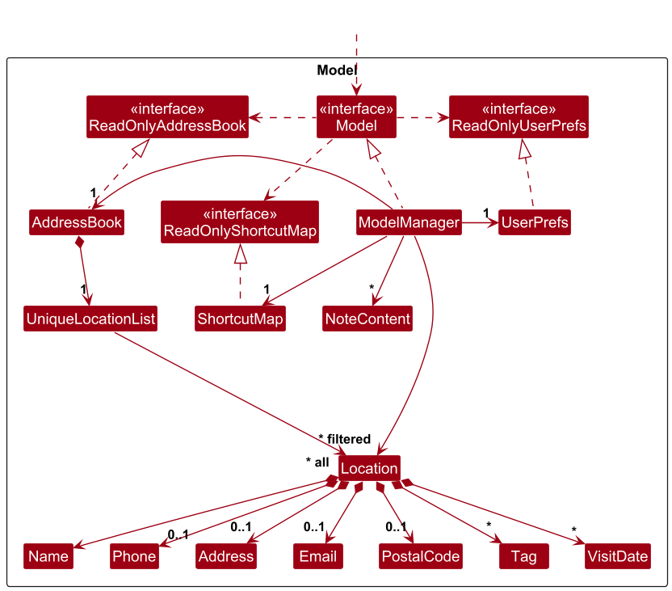
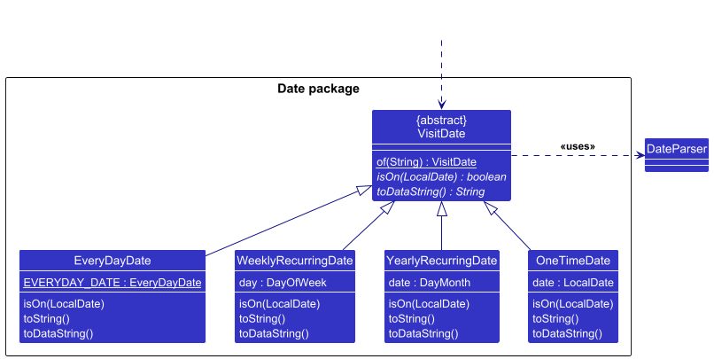
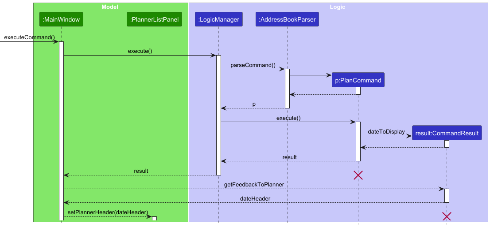

* Table of Contents
{:toc}

--------------------------------------------------------------------------------------------------------------------

## **Acknowledgements**
* This project is based on the AddressBook-Level3 project created by the [SE-EDU initiative](https://se-education.org).

### Libraries
* [JavaFX](https://openjfx.io/)
* [Jackson](https://github.com/FasterXML/jackson)
* [JUnit5](https://github.com/junit-team/junit5)
* [PlantUML](https://plantuml.com/stdlib)

--------------------------------------------------------------------------------------------------------------------

## **Setting up, getting started**

Refer to the guide [_Setting up and getting started_](SettingUp.md).

--------------------------------------------------------------------------------------------------------------------

## **Design**

<div markdown="span" class="alert alert-primary">

:bulb: **Tip:** The `.puml` files used to create diagrams are in this document `docs/diagrams` folder. Refer to the [_PlantUML Tutorial_ at se-edu/guides](https://se-education.org/guides/tutorials/plantUml.html) to learn how to create and edit diagrams.
</div>

<div style="page-break-after: always;"></div>

### Architecture


The ***Architecture Diagram*** given above explains the high-level design of the App.

Given below is a quick overview of main components and how they interact with each other.

**Main components of the architecture**

**`Main`** (consisting of classes [`Main`](https://github.com/se-edu/addressbook-level3/tree/master/src/main/java/seedu/address/Main.java) and [`MainApp`](https://github.com/se-edu/addressbook-level3/tree/master/src/main/java/seedu/address/MainApp.java)) is in charge of the app launch and shut down.
* At app launch, it initializes the other components in the correct sequence, and connects them up with each other.
* At shut down, it shuts down the other components and invokes cleanup methods where necessary.

The bulk of the app's work is done by the following four components:

* [**`UI`**](#ui-component): The UI of the App.
* [**`Logic`**](#logic-component): The command executor.
* [**`Model`**](#model-component): Holds the data of the App in memory.
* [**`Storage`**](#storage-component): Reads data from, and writes data to, the hard disk.

[**`Commons`**](#common-classes) represents a collection of classes used by multiple other components.

**How the architecture components interact with each other**

The *Sequence Diagram* below shows how the components interact with each other for the scenario where the user issues the command `delete 1`.



Each of the four main components (also shown in the diagram above),

* defines its *API* in an `interface` with the same name as the Component.
* implements its functionality using a concrete `{Component Name}Manager` class (which follows the corresponding API `interface` mentioned in the previous point.

For example, the `Logic` component defines its API in the `Logic.java` interface and implements its functionality using the `LogicManager.java` class which follows the `Logic` interface. Other components interact with a given component through its interface rather than the concrete class (reason: to prevent outside component's being coupled to the implementation of a component), as illustrated in the (partial) class diagram below.


The sections below give more details of each component.

### UI component

The **API** of this component is specified in [`Ui.java`](https://github.com/se-edu/addressbook-level3/tree/master/src/main/java/seedu/address/ui/Ui.java)



The UI consists of a `MainWindow` that is made up of parts e.g.`CommandBox`, `ResultDisplay`, `LocationListPanel`, `StatusBarFooter` etc. All these, including the `MainWindow`, inherit from the abstract `UiPart` class which captures the commonalities between classes that represent parts of the visible GUI.

The `UI` component uses the JavaFx UI framework. The layout of these UI parts are defined in matching `.fxml` files that are in the `src/main/resources/view` folder. For example, the layout of the [`MainWindow`](https://github.com/se-edu/addressbook-level3/tree/master/src/main/java/seedu/address/ui/MainWindow.java) is specified in [`MainWindow.fxml`](https://github.com/se-edu/addressbook-level3/tree/master/src/main/resources/view/MainWindow.fxml)

The `UI` component,

* executes user commands using the `Logic` component.
* listens for changes to `Model` data so that the UI can be updated with the modified data.
* keeps a reference to the `Logic` component, because the `UI` relies on the `Logic` to execute commands.
* depends on some classes in the `Model` component, as it displays `Location` object residing in the `Model`.

<div style="page-break-after: always;"></div>

### Logic component

**API** : [`Logic.java`](https://github.com/se-edu/addressbook-level3/tree/master/src/main/java/seedu/address/logic/Logic.java)

Here's a (partial) class diagram of the `Logic` component:


The sequence diagram below illustrates the interactions within the `Logic` component, taking `execute("delete 1")` API call as an example.


<div markdown="span" class="alert alert-info">:information_source: **Note:** The lifeline for `DeleteCommandParser` should end at the destroy marker (X) but due to a limitation of PlantUML, the lifeline continues till the end of diagram.
</div>

How the `Logic` component works:

1. When `Logic` is called upon to execute a command, it is passed to an `AddressBookParser` object which in turn creates a parser that matches the command (e.g., `DeleteCommandParser`) and uses it to parse the command.
1. This results in a `Command` object (more precisely, an object of one of its subclasses e.g., `DeleteCommand`) which is executed by the `LogicManager`.
1. The command can communicate with the `Model` when it is executed (e.g. to delete a location).<br>
   Note that although this is shown as a single step in the diagram above (for simplicity), in the code it can take several interactions (between the command object and the `Model`) to achieve.
1. The result of the command execution is encapsulated as a `CommandResult` object which is returned back from `Logic`.

Here are the other classes in `Logic` (omitted from the class diagram above) that are used for parsing a user command:


How the parsing works:
* When called upon to parse a user command, the `AddressBookParser` class creates an `XYZCommandParser` (`XYZ` is a placeholder for the specific command name e.g., `AddCommandParser`) which uses the other classes shown above to parse the user command and create a `XYZCommand` object (e.g., `AddCommand`) which the `AddressBookParser` returns back as a `Command` object.
* All `XYZCommandParser` classes (e.g., `AddCommandParser`, `DeleteCommandParser`, ...) inherit from the `Parser` interface so that they can be treated similarly where possible e.g, during testing.

<div style="page-break-after: always;"></div>

### Model component
**API** : [`Model.java`](https://github.com/se-edu/addressbook-level3/tree/master/src/main/java/seedu/address/model/Model.java)




The `Model` component,

* stores the address book data i.e., all `Location` objects (which are contained in a `UniqueLocationList` object).
* stores the currently displayed `Location` objects as a separate _filtered_ list which is exposed to outsiders as an unmodifiable `ObservableList<Location>` that can be observed, e.g. the UI can be bound to this list so that the UI automatically updates when the data in the list changes.
* stores the planner locations as a separate filtered list based on the selected date.
* stores a `UserPrefs` object that represents the user’s preferences. This is exposed to the outside as a `ReadOnlyUserPrefs` object.
* stores a `ShortcutMap` object that represents the user-defined shortcuts. This is exposed to the outside as a `ReadOnlyShortcutMap` object.
* manages note data used by the planner through `NoteContent`.
* does not depend on any of the other three components, as the `Model` represents domain entities that should make sense on their own.

<div style="page-break-after: always;"></div>

### Storage component

**API** : [`Storage.java`](https://github.com/se-edu/addressbook-level3/tree/master/src/main/java/seedu/address/storage/Storage.java)


The `Storage` component,
* can save both address book data and user preference data in JSON format, and read them back into corresponding objects.
* inherits from both `AddressBookStorage` and `UserPrefStorage`, which means it can be treated as either one (if only the functionality of only one is needed).
* depends on some classes in the `Model` component (because the `Storage` component's job is to save/retrieve objects that belong to the `Model`)

### Common classes

Classes used by multiple components are in the `seedu.address.commons` package.

--------------------------------------------------------------------------------------------------------------------

<div style="page-break-after: always;"></div>

## **Implementation**

This section describes some noteworthy details on how certain features are implemented.

### VisitDates
VisitDates in AddressMe have many different behaviours, possibly being recurring, or one-time. It is implemented
using polymorphism, where the subclasses support the few abstract methods required to function. The VisitDate class is
also implemented as a factory, taking in Strings to return a VisitDate of its appropriate subclasses.

- The isOn() function returns true if the date falls on the VisitDate inputted
- toString() returns a nicely formatted string displayed to the user
- toDataString() returns a string that can be re-parsed into the VisitDate, and is used to store data as files.



**To note:** EveryDayDate uses the Singleton pattern as every EveryDayDate should be the same.
It has a public static EverydayDate as an attribute for access.

### PlanCommand MCV Patterns
The `plan` command updates the user's GUI as well as the headers. This means it needs to pass information 
to the view controllers. We do this via the CommandResult class.



### Undo/redo feature

#### Implementation

Undo/redo is implemented as a single-level snapshot mechanism in `ModelManager`, scoped to undoable application state.

The model stores up to three snapshots:

* `pendingState`: the pre-command snapshot captured before a mutating command executes
* `undoState`: the last committed snapshot that `undo` can restore
* `redoState`: the last undone snapshot that `redo` can restore

Each snapshot stores:

* a copy of the `AddressBook`
* a copy of the `ShortcutMap`

The relevant model operations are:

* `Model#saveState()`: captures the current undoable state before a mutating command runs
* `Model#commitState()`: promotes the pending snapshot to the undo slot if the command actually changed state
* `Model#discardState()`: drops the pending snapshot when command execution fails
* `Model#undoState()`: restores the undo snapshot and saves the current state as the redo snapshot
* `Model#redoState()`: restores the redo snapshot and saves the current state as the undo snapshot

`LogicManager#execute(...)` coordinates this flow centrally:

1. Parse the command.
2. If `Command#isStateMutating()` is `true`, call `Model#saveState()`.
3. Execute the command.
4. If execution succeeds, call `Model#commitState()`.
5. If execution fails, call `Model#discardState()` so failed commands do not affect undo history.

`add`, `edit`, `delete`, `clear`, `note`, `shortcut set` and `shortcut remove` return `true` for `isStateMutating()`. Non-mutating commands such as `list`, `find` and `plan` do not change undo/redo history. `undo` and `redo` themselves also do not create new history entries.

Persistence is tracked separately from undo/redo history. `ModelManager` maintains dirty flags for the address book,
shortcut map, and user preferences, and `LogicManager` only saves the storage slices that have unsaved changes after a
successful command. As a result, read-only commands such as `list`, `find`, and `plan` do not trigger unnecessary disk
writes, while commands such as `theme`, `undo`, and `redo` still persist the correct data.

#### Behavior

The implementation is intentionally limited to one level:

* After one successful undo, there is no further undo available until another successful undoable change happens.
* Redo is available after a successful undo until another successful undoable change happens.
* A new successful undoable command clears the redo snapshot.
* Commands that succeed without changing undoable state, such as `clear` on an already empty address book, do not consume the undo/redo slots.

#### Design considerations

**Aspect: Snapshot granularity**

* **Alternative 1 (current choice):** Save the whole undoable app state.
  * Pros: Small implementation surface, keeps command classes simple, and supports address book and shortcuts uniformly.
  * Cons: Uses more memory than command-specific inverse operations.

* **Alternative 2:** Each command stores enough information to reverse itself.
  * Pros: Potentially more efficient and more flexible for future multi-level history.
  * Cons: Higher implementation risk because every mutating command must define and maintain its own inverse logic.

**Aspect: Where to trigger snapshotting**

* **Alternative 1 (current choice):** Centralize snapshot orchestration in `LogicManager`.
  * Pros: Mutating commands only need to declare that they change undoable state; failed commands can be handled consistently in one place.
  * Cons: Adds a small amount of command metadata via `isStateMutating()`.

* **Alternative 2:** Let each command decide when to save snapshots.
  * Pros: Commands can create a  snapshot at very precise points in execution.
  * Cons: Easier to forget in new commands, and failure handling becomes duplicated across commands.

### Substring Matching in Find Command

#### Implementation

The substring matching feature for the `find` command enables users to search for locations by matching any substring of their name, rather than requiring full word matches.

**Design Overview:**

The implementation involves three key components:

1. **StringUtil** - Low-level utility class that handles substring matching
   * Added new method: `containsSubstringIgnoreCase(String sentence, String substring)`
   * Performs case-insensitive substring matching using `String.toLowerCase().contains()`
   * Validates input (null checks, empty string checks)

2. **NameContainsKeywordsPredicate** - Filtering logic at the model layer
   * Located in `seedu.address.model.location` package (works with `Location` objects)
   * Modified `test()` method to use `containsSubstringIgnoreCase()` instead of `containsWordIgnoreCase()`
   * Maintains OR search logic: multiple keywords return matching locations if ANY keyword matches
   * Each keyword can now be a substring

3. **FindCommand** - Command execution layer
   * No changes needed; works seamlessly with the updated predicate
   * Reports filtered results to the UI through the model's filtered location list

**Sequence Flow:**

```
User Input: "find Jo"
    ↓
FindCommandParser → Creates FindCommand with NameContainsKeywordsPredicate(["Jo"])
    ↓
FindCommand.execute() → Calls Model.updateFilteredLocationList(predicate)
    ↓
NameContainsKeywordsPredicate.test(location) → For each location, checks:
    - containsSubstringIgnoreCase("John Restaurant", "Jo") → true ✓
    - containsSubstringIgnoreCase("Jane Cafe", "Jo") → false ✗
    ↓
Result: "John Restaurant" is included in filtered list
```

**Key Changes:**

| Component | Old Behavior | New Behavior |
|-----------|-------------|-------------|
| `StringUtil` | `containsWordIgnoreCase()` only (full word match) | Added `containsSubstringIgnoreCase()` (substring match) |
| `NameContainsKeywordsPredicate` | Uses `containsWordIgnoreCase()` with `Person` | Uses `containsSubstringIgnoreCase()` with `Location` |
| Find Command | `find Hans` ❌ matches partial name | `find Han` ✓ matches `Hans Restaurant` |

#### Design Considerations:

**Aspect: Substring vs. Full Word Matching**

* **Alternative 1 (current choice):** Substring matching (case-insensitive)
  * Pros: More flexible search; users can find locations with partial input (e.g., "Jo" matches "John's Restaurant", "Johan's Cafe", "Joust Arena")
  * Pros: Simple to implement using `String.contains()`
  * Cons: May return more results than user expects (e.g., "e" matches many location names)

* **Alternative 2:** Full word matching only (previous implementation)
  * Pros: More precise results; reduces false positives
  * Cons: Less flexible; requires exact word matches
  * Cons: Inconvenient for users who don't remember exact names

* **Alternative 3:** Regex-based matching
  * Pros: Maximum flexibility for complex patterns
  * Cons: Higher complexity; potential performance overhead
  * Cons: Poor user experience for non-technical users

**Aspect: Search Scope**

* **Current choice:** Search only in location names
  * Pros: Focused search; reduces noise
  * Cons: Cannot search by address, phone, email, tags, etc.
  * Future enhancement: Support for multi-field search (e.g., find by category tags, address, or distance)

#### Testing Strategy:

Comprehensive test coverage includes:

1. **Unit Tests** (`StringUtilTest`):
   - Substring at prefix, middle, suffix positions
   - Case-insensitive matching
   - Empty string and null validation

2. **Component Tests** (`NameContainsKeywordsPredicateTest`):
   - Single and multiple substring keywords
   - OR logic verification
   - Non-matching scenarios

3. **Integration Tests** (`FindCommandTest`, `FindCommandParserTest`):
   - End-to-end find command execution
   - Parser correctly handles substring keywords
   - Multiple locations matching different keywords
   - Test data includes typical locations (e.g., restaurants, attractions, hotels)

### Multi-Date Support

#### Implementation

The multi-date support feature allows a `Location` to have multiple visit dates. This is useful for users who visit the same location multiple times.

**Design Overview:**

1. **Location Model**
   - Changed `visitDate` field from a single `VisitDate` object to a `Set<VisitDate>`.
   - Updated constructor and getters to handle the set of visit dates.

2. **Predicate Logic**
   - Updated `VisitDateMatchesKeywordsPredicate` to check if a given date is present in the `Set<VisitDate>` of a `Location`.
   - The search follows AND logic for multiple date prefixes: a location must have **all** the specified dates to match.

3. **Parser Support**
   - Updated `AddCommandParser` and `EditCommandParser` to handle multiple `d/` prefixes.
   - `EditCommand` now supports `d/` (overwrite all), `d+/` (add specific dates), and `d-/` (remove specific dates).

4. **Storage Compatibility**
   - Updated `JsonAdaptedLocation` to handle both the old single `visitDate` field and the new `visitDates` array in the JSON file.
   - This ensures that users can upgrade to the new version without losing their existing data.

**Key Changes:**

| Component | Old Behavior | New Behavior |
|-----------|-------------|-------------|
| `Location` | Single `VisitDate` | `Set<VisitDate>` |
| `FindCommand` | Matches single last visit date | Matches if ANY visit date matches the keyword |
| `EditCommand` | Overwrites single visit date | Supports cumulative add/remove or overwrite |
| `Storage` | Saves/loads `visitDate` | Saves/loads `visitDates` (with backward compatibility) |

### Help Message Consistency

Help messages were made more consistent by using two standardized formats:

* a compact `Parameters`/`Example` format for single-purpose commands
* a Usage-based format for commands with multiple forms

Typical structure:

Single-purpose commands:
```
command: description
Parameters: ...
Example: ...
```
Multi-purpose commaands:
```
command: description
Usage:
  command form 1 – description
  command form 2 – description
Examples:
  example 1
  example 2
```

This improves readability without forcing all commands into one rigid structure. 

Commands such as `help`, `note`, and `shortcut` has all their modes specified in the `Usage` format with more than one example, while simpler commands remain concise.

--------------------------------------------------------------------------------------------------------------------

<div style="page-break-after: always;"></div>

## **Documentation, logging, testing, configuration, dev-ops**

* [Documentation guide](Documentation.md)
* [Testing guide](Testing.md)
* [Logging guide](Logging.md)
* [Configuration guide](Configuration.md)
* [DevOps guide](DevOps.md)

--------------------------------------------------------------------------------------------------------------------

## **Appendix: Requirements**

### Product scope

**Target user profile**:

* is a backpacker or traveller
* has a need to systematically catalogue multiple travel destinations and points of interest
* prefers lightweight desktop tools over visual-heavy travel apps
* can type fast and values high-efficiency, keyboard-driven workflows
* prefers typing to mouse interactions
* is comfortable using CLI applications for structured and searchable itinerary planning

**Value proposition**: It allows for much more efficient searching for destinations and planning routes between points, and a much more accessible and seamless UI for users to list, edit or delete the destinations (by contacts and address) they are interested in for overseas trips, leisure or social visits.


### User stories

Priorities: High (must have) - `* * *`, Medium (nice to have) - `* *`, Low (unlikely to have) - `*`

| Priority | As a …​                    | I want to …​                                                                  | So that I can…​                                                             |
|----------|----------------------------|-------------------------------------------------------------------------------|-----------------------------------------------------------------------------|
| `* * *`  | user                       | add a new record with its address and contact details                         | have a central record of where to go next                                   |
| `* * *`  | user                       | delete an existing record                                                     | remove unwanted entries                                                     |
| `* * *`  | user                       | exit the program                                                              | -                                                                           |
| `* * *`  | user                       | save my data                                                                  | revisit the app                                                             |
| `* * *`  | user                       | edit details of a saved place                                                 | correct or update information                                               |
| `* * *`  | experienced user           | use up and down arrows to echo my past commands                               | quickly retry commands that have a minor mistake                            |
| `* * *`  | user                       | save my friends’ addresses                                                    | easier meetups and not have to store them separately from my travels        |
| `* * *`  | student                    | handle my classwork that requires moving to mobile places                     | have a better plan without being confused about where to go next            |
| `* * *`  | busy user                  | Organize my locations by dates                                                | remember where I have to be on a certain day                                |
| `* * *`  | user                       | View a schedule for my locations by date                                      | be more organized                                                           |
| `* *`    | user                       | add keywords/notes to specific addresses                                      | remember the details easily                                                 |
| `* *`    | experienced user           | set shortcuts for my commands                                                 | use the app more efficiently                                                |
| `* *`    | frequent user              | save shortcuts across restarts                                                | avoid recreating them every time I open the app                             |
| `* *`    | user                       | mark my destinations with dates                                               | get an overview of the whole day                                            |
| `* *`    | food explorer              | manage restaurant recommendations                                             | easily keep track of their addresses and opening hours                      |
| `* *`    | food explorer              | group restaurant recommendations                                              | sort them out by preference/some other metric                               |
| `* *`    | new user                   | view a help message explaining the keyboard commands                          | quickly learn how to use the app                                            |
| `* *`    | tech-savvy user            | use a single keyboard command to search for all "sightseeing" spots           | find my next destination fast and easily                                    |
| `* *`    | hasty user                 | quickly navigate my previous commands                                         | repeat my frequent commands and save time typing                            |
| `* *`    | cautious solo traveller    | store emergency contacts (embassy, hospital, local police)                    | access them quickly in urgent situations                                    |
| `* *`    | user                       | change the application's colour (light/dark mode)                             | read the content comfortably                                                |
| `* *`    | user                       | pin important locations                                                       | quickly see my highest-priority entries                                     |
| `* *`    | user with poor eyesight    | change my font size                                                           | see the content clearly                                                     |
| `* *`    | user                       | edit phone numbers or addresses easily                                        | outdated contact details do not mislead me                                  |
| `* *`    | clumsy user                | undo my previous actions                                                      | rectify any accidental commands                                             |
| `* *`    | frequent traveller         | store different time zones                                                    | avoid making calls at inappropriate timings                                 |
| `* *`    | solo traveller             | mark places as favorites                                                      | prioritize places I do not want to miss                                     |
| `* *`    | user                       | archive places I have already visited                                         | keep my active list uncluttered                                             |
| `* *`    | user                       | search for keywords in my contacts/addresses                                  | find one/several particular addresses without manual searching              |
| `* *`    | user                       | tag different places based on groups (restaurants, attractions, hotels)       | filter for the type of location I am looking for                            |
| `* *`    | concerned user             | mark destination information as verified or unverified                        | remember which destinations I have personally confirmed                     |
| `*`      | user                       | group my destinations logically or manually                                   | view related destinations together                                          |
| `*`      | user                       | sort saved places by distance                                                 | optimize my walking route and avoid backtracking                            |
| `*`      | frequent planner/traveller | reliably set repeat trips (e.g. every second Sunday I'm going home)           | maintain regular routines like visiting family or planning frequent outings |
| `*`      | user                       | attach notes to the places I’ve been                                          | remember if I enjoyed the place, or never want to go back                   |
| `*`      | user                       | see my destinations in a schedule view                                        | easily visualize my itinerary                                               |
| `*`      | user                       | attach and record my expenses                                                 | manage my budget                                                            |
| `*`      | dark mode user             | use the app in dark mode                                                      | keep it consistent with the rest of my setup                                |
| `*`      | parent                     | organize my trip together with different users (family, friends, tour agency) | allow them to contribute ideas/routes for my trip                           |


### Use cases

(For all use cases below, the **System** is `AddressMe` and the **Actor** is the `user`, unless specified otherwise)

**Use case: Add a location**

**MSS**

1. User inputs the details of a location.
2. User submits the details to the system.
3. System confirms the addition.
4. System shows the updated list.
Use case ends.

**Extensions**

* 2a. The given details are invalid.
* 2a1. System shows an error message, and if it can handle gracefully with incomplete data, will show the details it managed to add.
Use case resumes at step 3.


* 2b. The given location name is invalid.
* 2b1. System shows an error message and informs the user it is unable to add the entry.
Use case ends.

---

**Use case: Shorten/specify own commands to enhance usage speed**

**MSS**

1. User requests to create a shortcut for an existing command.
2. System validates the shortcut and the referenced command.
3. System saves the shortcut.
4. System confirms that the shortcut has been created.
   Use case ends.

**Extensions**

**2a. The alias violates validation constraints.**
(e.g. contains illegal characters, matches a reserved keyword, or conflicts with an existing alias)
2a1. System rejects the request and shows an appropriate error message.
Use case ends.


**2b. The referenced command word is invalid.**
(e.g. command does not exist or is not eligible for aliasing)
2b1. System shows an error message indicating that the command is invalid.
Use case ends.


**3a. Saving the shortcut fails due to a storage I/O error.**
3a1. System shows an error message and does not persist the shortcut.
Use case ends.

---

**Use case: Edit a location**

**MSS**

1. User requests to list locations using the list command.
2. System shows a list of locations.
3. User requests to edit a specific location in the list by providing its index and the new details to be updated.
4. System updates the location and shows a success message with the updated details.
Use case ends.

**Extensions**

* 2a. The list is empty.
Use case ends.
* 3a. The given index is invalid (out of range or non-numeric).
* 3a1. System shows an error message: "Invalid index. Please enter a valid location index."
Use case resumes at step 2.


* 3b. The provided email format is invalid.
* 3b1. System shows an error message regarding the invalid email.
Use case resumes at step 2.


* 3c. The provided phone number format is invalid.
* 3c1. System shows an error message regarding the invalid phone number.
Use case resumes at step 2.


* 3d. The edited details result in a duplicate entry (it matches an existing entry's name + phone/email).
* 3d1. System rejects the edit, leaves the original record unchanged, and shows an error message.
Use case resumes at step 2.

---

**Use case: List all locations**

**MSS**

1. User enters the list command.
2. System shows a list of locations.
Use case ends.

**Extensions**

* 2a. The list is empty.
* 2a1. System informs the user the list is empty.
Use case ends.

---

**Use case: Modify your schedule on a specific day**

**MSS**

1. User enters the plan command with the desired date.
2. System shows all the locations that fall on that date.
3. User edits a location to add it to the date.
4. System shows the updated schedule on that day.
   Use case ends.

**Extensions**

* 1a. The entered date is invalid.
* 1a1. System informs the user of correct date and command format.
  Use case ends.

---

**Use case: Save and exit**

**MSS**

1. User enters the exit command.
2. System closes the application.
Use case ends.

**Extensions**

---

**Use case: Delete one or more locations**

**MSS**

1. User requests to list locations.
2. System shows a list of locations.
3. User requests to delete one or more locations.
4. System deletes all specified locations.
Use case ends.

**Extensions**

* 2a. The list of locations is empty.
* 2a1. System informs the user that there are no locations to delete.
Use case ends.


* 3a. At least one given index is invalid.
* 3a1. System shows an error message.
* 3a2. System lists the available locations again.
Use case resumes at step 2.


* 3b. Duplicate indices are provided (e.g., `delete 2 2`).
* 3b1. System shows an error message.
* 3b2. System lists the available locations again.
Use case resumes at step 2.


* 5a. An error occurs during deletion.
* 5a1. System informs the user that the deletion failed.
Use case ends.


* *a. At any time, the user cancels the delete operation.
* *a1. System aborts the delete operation.
Use case ends.

---

**Use case: Undo the last change**

**MSS**

1. User executes a successful command.
2. User wants to undo the command.
3. System restores the previous state.
4. System shows a success message.
Use case ends.

**Extensions**

* 2a. There is no stored undo state.
* 2a1. System shows an error message.
Use case ends.

---

**Use case: Redo the last undone change**

**MSS**

1. User successfully undoes an undoable change.
2. User wants to redo the change.
3. System reapplies the undone state.
4. System shows a success message.
Use case ends.

**Extensions**

* 2a. There is no stored redo state.
* 2a1. System shows an error message.
Use case ends.

### Non-Functional Requirements

1. Should work on any _mainstream OS_ as long as it has Java `17` or above installed.
2. Should be able to hold up to 1000 locations without a noticeable sluggishness in performance for typical usage.
3. Should display a list of 1000 entries under 0.5 seconds when searching or using the “list” command.
4. A user with above average typing speed for regular English text (i.e. not code, not system admin commands) should be able to accomplish most of the tasks faster using commands than using the mouse.
5. Should work well for standard screen resolutions 1920x1080 and higher of 100% and 125% scales.
6. Should be usable for resolutions 1280x720 and higher and for screen scales 150%.

### Glossary

* **Mainstream OS**: Windows, macOS, and Linux.
* **Location**: A saved place in AddressMe together with its contact and address details.
* **Tag**: A label used to group similar saved locations.

--------------------------------------------------------------------------------------------------------------------

<div style="page-break-after: always;"></div>

## **Appendix: Instructions for manual testing**

Given below are instructions to test the app manually.

<div markdown="span" class="alert alert-info">:information_source: **Note:** These instructions only provide a starting point for testers to work on;
testers are expected to do more *exploratory* testing.

</div>

### Help Command

#### Viewing help information

1. Viewing general help

    1. Test case: `help`  
       Expected: A summary of all commands is displayed in the help window or output area.

2. Viewing help for a specific command

    1. Test case: `help add`  
       Expected: Detailed usage information for the `add` command is displayed.

3. Opening the user guide

    1. Test case: `help -ug`  
       Expected: The user guide is opened in a new window or browser.

4. Invalid usage

    1. Test case: `help unknowncommand`  
       Expected: An error message is shown indicating the command is invalid.

### Launch and shutdown

1. Initial launch

   1. Download the jar file and copy into an empty folder

   1. Run `java -jar AddressMe.jar` in terminal. Expected: Shows the GUI with a set of sample contacts. The window size may not be optimum.

1. Saving window preferences

   1. Resize the window to an optimum size. Move the window to a different location. Close the window.

   1. Re-launch the app by double-clicking the jar file.<br>
       Expected: The most recent window size and location is retained.

### Autocomplete

1. Autocomplete a command with no shared prefix
    1. Press `Tab` after typing `a`. Expected: the command line now shows `add`

1. Autocomplete command with shared prefix
   1. Press `Tab` after typing `e`. Expected: the command line still shows `e` (Since `exit` and `edit` exist)

### CLI History
1. Recalling previous commands
   1. With an empty command line, press `UP` repeatedly. Expected: Command line scrolls through previous commands
   2. Now press `DOWN` repeatedly. Expected: Command line goes forward through commands and becomes blank again.
1. Recalling commands after an error
   1. Enter an erroneous command (the text should turn red)
   1. Press `UP` once. Expected: Should see the command entered before the erroneous command.

### Deleting a location

1. Deleting a location while all locations are being shown

   1. Prerequisites: List all locations using the `list` command. Multiple locations in the list.

   1. Test case: `delete 1`<br>
      Expected: First contact is deleted from the list. Details of the deleted contact shown in the status message. Timestamp in the status bar is updated.

   1. Test case: `delete 1 2`<br>
      Expected: First and second contacts are deleted from the list. Number of deleted locations shown in the status message. Timestamp in the status bar is updated.

   1. Test case: `delete 0`<br>
      Expected: No location is deleted. Error details shown in the status message. Status bar remains the same.

   1. Other incorrect delete commands to try: `delete`, `delete x`, `delete 1 1`, `...` (where x is larger than the list size)<br>
      Expected: Similar to previous.


### Undoing and redoing changes

1. Undo after a successful modifying command

   1. Prerequisites: Start with at least one location in the list.

   1. Test case: `delete 1` followed by `undo`<br>
      Expected: The deleted location reappears. A success message for `undo` is shown.

   1. Test case: `clear` followed by `undo`<br>
      Expected: All previously saved locations are restored.

   1. Test case: `shortcut set a add` followed by `undo`<br>
      Expected: The shortcut `a -> add` is removed.

2. Undo when no undo state exists

   1. Prerequisites: Fresh app start with no prior successful undoable command.

   1. Test case: `undo`<br>
      Expected: No data changes. An error message is shown.

3. Redo after undo

   1. Prerequisites: Execute `add n/Test Place`, then `undo`.

   1. Test case: `redo`<br>
      Expected: `Test Place` is added back. A success message for `redo` is shown.

   1. Test case: `redo` again<br>
      Expected: No data changes. An error message is shown because only one redo level is supported.

### Using Planner Panel

1. Viewing Locations and Notes
   1. After adding dates to locations and notes, use `plan DATE` where DATE is the same date. 
   Expected: The locations and notes added should appear in the planner and the header changes to DATE.
2. Changing entities with Planner open
   1. `delete` a location or `note d-/` a note currently in the open planner. Expected: The planner is updated and the entity disappears.
   2. `undo` your action. Expected: The item reappears in the planner.
3. Clearing the planner
   1. Type `plan` in the Command line. 
   Expected: The planner is cleared and the header resets. The locations can still be view in the left list.

### Flexible Name and Phone Input

1. Adding locations with flexible names

    1. Test case:  
       `add n/McDonald's @ Orchard a/Some address c/123456`  
       Expected: Location is successfully added.

    2. Test case:  
       `add n/!!! a/Some address`  
       Expected: Error message shown (no alphanumeric character).

2. Adding locations with flexible phone numbers

    1. Test case:  
       `add n/Test p/+65 9123 1234`  
       Expected: Location is successfully added.

    2. Test case:  
       `add n/Test p/123-456-789`  
       Expected: Location is successfully added.

    3. Test case:  
       `add n/Test p/-1234`  
       Expected: Error message shown.


### Editing Fields to Empty

1. Clearing a field using edit

    1. Prerequisites: At least one location exists with a phone number

    2. Test case:  
       `edit 1 p/`  
       Expected: Phone number of the location is removed.

    3. Test case:  
       `edit 1 n/`  
       Expected: Name cannot be empty, error message shown (if applicable).

---

<div style="page-break-after: always;"></div>

## **Appendix: Planned Enhancements**

Team size: 5

1. Support autocomplete for tags. Typing `t/a`, `t+/a` or `t-/a` then pressing `Tab` would autocomplete with any existing tags.
   This is done by having a persistent tag management system, and storing tags in data files.
2. Currently, the implementation of different commands have slightly differing formats. <br>Sometimes, commands take in strings with the `n/` prefix, like in `add`, but in `find` it does not. Then, in `plan` it doesn't take in a date with the `d/` prefix either.
<br>Standardise ALL commands to use the prefixes for every variable. This applies even for INDEX, with proposed tag i/. This makes it clearer to the user that every field must be prefixed.
3. Support data archiving. Old locations that is no longer needed can be archived for the future, so they don't appear but still recoverable.
