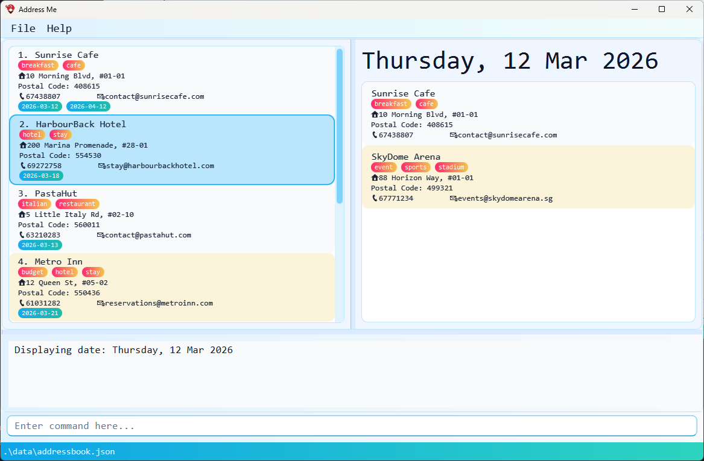

AddressMe is a **desktop app for managing destinations, optimized for use via a Command Line Interface** (CLI) while still having the benefits of a Graphical User Interface (GUI). If you can type fast, AddressMe can get your contact management tasks done faster than traditional GUI apps.

* Table of Contents
{:toc}

--------------------------------------------------------------------------------------------------------------------

## Quick start

1. Ensure you have Java `17` or above installed in your Computer.<br>
   **Mac users:** Ensure you have the precise JDK version prescribed [here](https://se-education.org/guides/tutorials/javaInstallationMac.html).

1. Download the latest `.jar` file from [here](https://github.com/se-edu/addressbook-level3/releases).

1. Copy the file to the folder you want to use as the _home folder_ for your AddressBook.

1. Open a command terminal, `cd` into the folder you put the jar file in, and use the `java -jar addressbook.jar` command to run the application.<br>
   A GUI similar to the below should appear in a few seconds. Note how the app contains some sample data.<br>
   

1. Type the command in the command box and press Enter to execute it. e.g. typing **`help`** and pressing Enter will open the help window.<br>
   Some example commands you can try:

   * `list` : Lists all contacts.

   * `add n/John Doe p/98765432 e/johnd@example.com a/John street, block 123, #01-01` : Adds a contact named `John Doe` to the Address Book.

   * `delete 3` : Deletes the 3rd contact shown in the current list.

   * `clear` : Deletes all contacts.

   * `exit` : Exits the app.

1. Refer to the [Features](#features) below for details of each command.

--------------------------------------------------------------------------------------------------------------------

## Features

<div markdown="block" class="alert alert-info">

**:information_source: Notes about the command format:**<br>

* Words in `UPPER_CASE` are the parameters to be supplied by the user.<br>
  e.g. in `add n/NAME`, `NAME` is a parameter which can be used as `add n/John Doe`.

* Items in square brackets are optional.<br>
  e.g `n/NAME [t/TAG]` can be used as `n/John Doe t/friend` or as `n/John Doe`.

* Items with `…`​ after them can be used multiple times including zero times.<br>
  e.g. `[t/TAG]…​` can be used as ` ` (i.e. 0 times), `t/friend`, `t/friend t/family` etc.

* Parameters can be in any order.<br>
  e.g. if the command specifies `n/NAME p/PHONE_NUMBER`, `p/PHONE_NUMBER n/NAME` is also acceptable.

* Extraneous parameters for commands that do not take in parameters (such as `help`, `list`, `exit` and `clear`) will be ignored.<br>
  e.g. if the command specifies `help 123`, it will be interpreted as `help`.

* Date fields support the formats: `yyyy/M/d`, `d/M/yyyy`, `d/M/yy` as well as hyphenated variants.
E.g. 2 Jan 2026 can be typed as `2026/01/02`, `2/1/26`, `2026-1-02`, `02-1-2026`.
* Date fields support optional years: `d/M` and `d-M`. It will default to a date that has not passed.
E.g. If today was 2 Jan 2026, `01/01` would be 1 Jan 2027, `2/1` would be 2 Jan 2026, `3/1` would be 3 Jan 2026
* Date fields support days of the week, e.g. `Tue`, `Friday` (non-case-sensitive). It will default to the upcoming day of the week.
E.g. If today was Tuesday, `Tue` would be today, `Wednesday` would be tomorrow, `Mon` would be next Monday.

* If you are using a PDF version of this document, be careful when copying and pasting commands that span multiple lines as space characters surrounding line-breaks may be omitted when copied over to the application.
</div>

### Viewing help : `help`

Shows a message explaining how to access the help page.


Format: `help`


### Adding a location: `add`

Adds a location to the address book.

Format: `add n/NAME p/PHONE_NUMBER e/EMAIL a/ADDRESS [t/TAG]…​`

<div markdown="span" class="alert alert-primary">:bulb: **Tip:**
A location can have any number of tags (including 0)
</div>

Examples:
* `add n/John Doe p/98765432 e/johnd@example.com a/John street, block 123, #01-01`
* `add n/Betsy Crowe t/friend e/betsycrowe@example.com a/Newgate Prison p/1234567 t/criminal`

### Listing all locations : `list`

Shows a list of all locations in the address book.

Format: `list`

### Managing command shortcuts : `shortcut`

Creates, removes, and lists shortcuts for existing command words.

Format: 
```
shortcut set ALIAS COMMAND_WORD
shortcut remove ALIAS
shortcut list
```

* Only the first token of user input is expanded.
* Aliases are case-insensitive and are stored in lowercase.
* Aliases must start with a letter and contain only alphanumeric characters.
* Aliases cannot reuse existing command words such as `add` or `list`.
* `COMMAND_WORD` must be an existing built-in command word.

Examples:
* `shortcut set a add`     Creates alias 'a' for 'add'
* `shortcut set e edit`    Creates alias 'e' for 'edit'
* `shortcut list`          Lists all defined shortcuts
* `shortcut remove e`      Removes alias 'e'

### Editing a location : `edit`

Edits an existing location in the address book.

Format: `edit INDEX [n/NAME] [p/PHONE] [e/EMAIL] [a/ADDRESS] [t/TAG]…​`

* Edits the location at the specified `INDEX`. The index refers to the index number shown in the displayed location list. The index **must be a positive integer** 1, 2, 3, …​
* At least one of the optional fields must be provided.
* Existing values will be updated to the input values.
* When editing tags, the existing tags of the location will be removed i.e adding of tags is not cumulative.
* You can remove all the location’s tags by typing `t/` without
    specifying any tags after it.

Examples:
*  `edit 1 p/91234567 e/johndoe@example.com` Edits the phone number and email address of the 1st location to be `91234567` and `johndoe@example.com` respectively.
*  `edit 2 n/Betsy Crower t/` Edits the name of the 2nd location to be `Betsy Crower` and clears all existing tags.

### Locating locations by name or other attributes: `find`

Finds locations whose attributes match all of the given parameters (AND semantics across all specified prefixes and repeated prefixes). Unprefixed keywords before any prefix are treated as name keywords combined with OR semantics.

Format: `find [KEYWORD] [MORE_KEYWORDS] [n/NAME] [p/PHONE] [e/EMAIL] [a/ADDRESS] [t/TAG] [d/DATE]`

* The search is case-insensitive. e.g `thai` will match `Thai Pavilion`
* The order of the unprefixed name keywords (the preamble) does not matter. e.g. `Restaurant Marina` will match `Marina Restaurant`.
* **Substring matching is supported** for Name, Phone, Email, and Address. Tag matching is exact but case-insensitive.
* Multiple prefixes (and multiple occurrences of the same prefix) can be used to narrow down the search using AND semantics. e.g., `n/Bakery t/Halal t/Vegetarian` will find locations that have "Bakery" in their name AND have both the "Halal" and "Vegetarian" tags.
* Only the unprefixed name keywords use OR semantics: a location matches if its name contains at least one of those keywords. e.g., `find Ramen Cafe` will return `Ramen House`, `Cafe Mocha`.
* Each prefixed value (`n/`, `p/`, `e/`, `a/`, `t/`, `d/`) is treated as a single search string, even if it contains spaces (no further splitting into keywords is done).
* **Date search** (`d/`) accepts any date format or keyword supported by AddressMe’s date parser (including formats like `YYYY-MM-DD` and `DD/MM/YYYY`, e.g. `15/01/2024`) and matches the last visit date exactly (no range or partial matching).

Examples:
* `find Restaurant` returns all locations with "Restaurant" in the name.
* `find n/Hanjin p/9123` returns locations with "Hanjin" in the name AND "9123" in the phone number.
* `find t/Japanese t/Halal` returns locations that have BOTH "Japanese" AND "Halal" tags.
* `find d/2023-10-15` returns locations last visited on 15th Oct 2023.
* `find Marina Beach` returns `Marina Park`, `Beach Resort` (OR search for names).
* `find n/Cafe e/gmail.com` returns all cafes with a Gmail address.

### Deleting a location : `delete`

Deletes one or more specified locations from the address book.

Format: `delete INDEX [MORE_INDEXES]...`

* Deletes the locations at the specified `INDEX` values.
* The indices refer to the index numbers shown in the displayed location list.
* Every index **must be a positive integer** 1, 2, 3, …​
* Duplicate indices are not allowed.

Examples:
* `list` followed by `delete 2` deletes the 2nd location in the address book.
* `find Sentosa` followed by `delete 1` deletes the 1st location in the results of the `find` command.
* `list` followed by `delete 1 3 5` deletes the 1st, 3rd, and 5th locations in the address book.

### Clearing all entries : `clear`

Clears all entries from the address book.

Format: `clear`

### Exiting the program : `exit`

Exits the program.

Format: `exit`

### Saving the data

AddressBook data are saved in the hard disk automatically after any command that changes the data. There is no need to save manually.

### Editing the data file

AddressBook data are saved automatically as a JSON file `[JAR file location]/data/addressbook.json`. Advanced users are welcome to update data directly by editing that data file.

<div markdown="span" class="alert alert-warning">:exclamation: **Caution:**
If your changes to the data file makes its format invalid, AddressBook will discard all data and start with an empty data file at the next run. Hence, it is recommended to take a backup of the file before editing it.<br>
Furthermore, certain edits can cause the AddressBook to behave in unexpected ways (e.g., if a value entered is outside of the acceptable range). Therefore, edit the data file only if you are confident that you can update it correctly.
</div>

### Archiving data files `[coming in v2.0]`

_Details coming soon ..._

## CLI Features

### Accessing input history
During the session, your inputs are recorded.

While clicked into the CLI, press the `UP arrow` and `DOWN arrow` to navigate through previously entered commands.

E.g. After entering `list` and `find John` into the CLI, pressing `UP` while in the empty text field will write `find John` in the textbox. Pressing `UP` again will replace it with `list`.

### Autocomplete
While having text in the command line, the user can press the `Tab` key to attempt to autocomplete the command.

The autocomplete uses the current text to find matching command keywords, while being case-insensitive. If there are multiple matches, it fills to the longest shared prefix.

E.g. `A` autocompletes into `add`, while `e` autocompletes to `e`, since both `exit` and `edit` are possible commands.

--------------------------------------------------------------------------------------------------------------------

## FAQ

**Q**: How do I transfer my data to another Computer?<br>
**A**: Install the app in the other computer and overwrite the empty data file it creates with the file that contains the data of your previous AddressBook home folder.

--------------------------------------------------------------------------------------------------------------------

## Known issues

1. **When using multiple screens**, if you move the application to a secondary screen, and later switch to using only the primary screen, the GUI will open off-screen. The remedy is to delete the `preferences.json` file created by the application before running the application again.
2. **If you minimize the Help Window** and then run the `help` command (or use the `Help` menu, or the keyboard shortcut `F1`) again, the original Help Window will remain minimized, and no new Help Window will appear. The remedy is to manually restore the minimized Help Window.

--------------------------------------------------------------------------------------------------------------------

## Command summary

Action | Format, Examples
--------|------------------
**Add** | `add n/NAME p/PHONE_NUMBER e/EMAIL a/ADDRESS [t/TAG]…​` <br> e.g., `add n/James Ho p/22224444 e/jamesho@example.com a/123, Clementi Rd, 1234665 t/friend t/colleague`
**Clear** | `clear`
**Delete** | `delete INDEX [MORE_INDEXES]...`<br> e.g., `delete 3` or `delete 1 2 3`
**Edit** | `edit INDEX [n/NAME] [p/PHONE_NUMBER] [e/EMAIL] [a/ADDRESS] [t/TAG]…​`<br> e.g.,`edit 2 n/James Lee e/jameslee@example.com`
**Find** | `find [KEYWORD] [MORE_KEYWORDS] [n/NAME] [p/PHONE] [e/EMAIL] [a/ADDRESS] [t/TAG] [d/DATE]`<br> e.g., `find n/Cafe t/Halal`
**List** | `list`
**Help** | `help`
**Shortcut** | `shortcut set ALIAS COMMAND_WORD` / `shortcut remove ALIAS` / `shortcut list`<br> e.g., `shortcut set a add`, `shortcut remove a`, `shortcut list`
