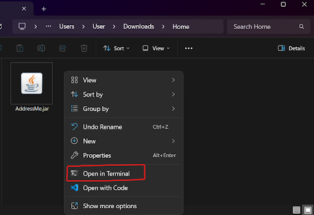

---

> **FAST • FLEXIBLE • FOOLPROOF**

_Purpose-built, clutter-free itinerary planner designed for digital nomads_

---

AddressMe helps you **plan and track** your travel destinations, dates, and important details in one convenient platform, optimised for use entirely through a **Command Line Interface** (CLI) with the benefits of a Graphical User Interface (GUI).

It offers a **minimalist, easy-to-learn experience** designed for digital nomads who need their location data to be structured and always accessible. If you can type quickly and get frustrated by over-engineered itinerary planners, AddressMe is the app for you!

---

<h2>Do you:</h2>

- **Move regularly** and need to track multiple locations and visit plans?
- Need your data even with **unreliable internet**?
- Prefer **typing** over clicking through menus?
- Feel frustrated by overly complicated itinerary planners?

<h3 style="font-weight: bold;">If so, AddressMe is built for you!</h3>

---

* Table of Contents
{:toc}

--------------------------------------------------------------------------------------------------------------------
## 1. Quick Start

---
### Installation

1. Ensure you have Java `17` or above installed on your machine.<br>
   You can do this by opening the Command Prompt app (for Windows users), or Terminal (for Mac/Linux users) and entering "`java -version`".<br>
1. Download the latest version of `addressbook.jar` from the GitHub releases page [here](https://github.com/AY2526S2-CS2103T-W14-3/tp/releases).
2. Place the AddressMe.jar file in a folder - this becomes your AddressMe home folder.
3. While in your home folder, right-click and select "Open in Terminal"
   
4. Enter the following command into the terminal:
   `java -jar addressbook.jar`
5. That's it! AddressMe launches with sample data, and you can plan your trip immediately.

<div markdown="block" class="alert alert-warning">

**:warning: Mac users:**<br>

Ensure you have the exact Java JDK version [here](https://se-education.org/guides/tutorials/javaInstallationMac.html) to avoid compatibility issues.

</div>

### Interface Overview


AddressMe has four main UI zones:

| **Feature**       | **Description**                                                          |
| ----------------- | ------------------------------------------------------------------------ |
| **Command Box**   | Type your commands here and press Enter to execute.                      |
| **Result Panel**  | Displays confirmation messages, search results, and errors encountered.  |
| **Location List** | Shows all your saved locations, updated in real time after each command. |
| **Planner Panel** | View destinations on a specific date (using the **plan** command).       |

## 2. Starting to use Commands

Before we dive into each feature, here's a tip to make everything smooth and easy.

Every command has a helpful guiding message:


A valid **add** command is shown below.


| **Format**               | **Description**                                                                                                                                                       |
|--------------------------|-----------------------------------------------------------------------------------------------------------------------------------------------------------------------|
| **UPPER_CASE**           | A value you must supply. e.g. NAME in add n/NAME means you type the actual name.<br><br>e.g. "_n/_**_Nomad Hub_**_"_                                                  |
| **\[Square brackets\]**  | Optional parameters. You may include it or leave it out.<br><br>E.g. _"_**_\[e/EMAIL\]_**_"_ is optional so we can leave it out.                                      |
| **t/TAG...**             | The ellipsis means you can submit more than one of these parameters.<br><br>e.g. "_t/_**_workplace_**_" OR "t/_**_workplace_** _t/_**_networking_**_"_                |
| **Any order**            | Parameters can be entered in any order unless specified otherwise.<br><br>e.g. "_t/_**_workplace_** _n/_**_Nomad Hub_**_" OR "n/_**_Nomad Hub_** _t/_**_workplace_**" |
| **Single-word commands** | Some commands take no extra parameters, like **help**, **list**, **exit**, **clear**.                                                                                 |

### Date Formats

AddressMe even accepts a large range of date inputs so you can type dates flexibly.

- Dates are separated with **slashes** ("**/**") or **hyphens** ("**\-**").
- With **day**, **month** and **year** fully specified:

| **With slashes** | **With hyphens** |
|------------------|------------------|
| **YYYY/MM/DD**   | **YYYY-MM-DD**   |
| **YYYY/M/D**     | **YYYY-M-D**     |
| **D/M/YYYY**     | **D-M-YYYY**     |
| **D/M/YY**       | **D-M-YY**       |

- With **day** and **month** (no **year**): AddressMe picks the next occurrence of that date.

| **DD/MM** | **DD-MM** |
|-----------|-----------|
| **D/M**   | **D-M**   |

- With **day of the week** (case-insensitive): AddressMe picks the upcoming date of that weekday.

| **Long form**       | **Short form** (First 3 letters) |
|---------------------|----------------------------------|
| **Monday - Sunday** | **Mon - Sun**                    |


<div markdown="span" class="alert alert-primary">

**:bulb:Pro Tip - Fast Dates:**
If today is Tuesday, typing `Tue` matches today. Typing `Wednesday` or `Wed` matches tomorrow. Typing `Mon` matches next Monday!<br>
Alternatively, typing `today` also works!

</div>

- **Recurring Dates:** You can mark locations with recurring dates by starting it with `e-` or `every `!
<br>`DAY_MONTH` and `DAY_OF_WEEK` accepts the formats specified above.

| **Recurring type** | **Format**                                                                                                                      |
|--------------------|---------------------------------------------------------------------------------------------------------------------------------|
| **Everyday**       | `everyday` or `every day` (case-insensitive)                                                                                    |
| **Weekly**         | `e-DAY_OF_WEEK`, `every DAY_OF_WEEK` <br>Example: `edit 1 d/e-Sun` edits a location to happen every Sunday                      |
| **Yearly**         | `e-DAY_MONTH`, `every DAY_MONTH`   <br>Example: `add n/Mom's House d/every 25/12` adds an entry that happens every 25 December. |

---
### Start Your First Commands

Now that you're familiar with commands, try typing these commands into AddressMe to get a feel for the application.

- `list`

Shows all saved locations.

- `find Cafe`

Searches for any location with 'Cafe' in its name.

- `add n/Nomad Hub e/hello@nomadhub.com a/12 Tanjong Pagar t/coworking`

Adds a new coworking space.

- `plan 2026-04-01`

Shows your itinerary plan for 1 April 2026.

- `exit`

Closes the application.

When you're comfortable with sending commands, you're ready to dive deeper into each [feature](#3-features---full-reference)!

--------------------------------------------------------------------------------------------------------------------

## 3. Features - Full Reference

If you are already familiar with the commands, skip straight to the [command summary](#4-command-summary) to refresh your memory!

### `help` - Viewing help

Shows you commands you can use, as well as _how_ to use specific commands.

Formats:
```
help
help COMMAND_WORD
help -ug
```

* `help` displays a summary of all supported commands in AddressMe.
* `help COMMAND_WORD` displays detailed local guidance for that command.<br>
`COMMAND_WORD` must be an existing built-in command word.

Example:<br>
`help add` shows the specific usage for the `add` command.

* `help -ug` opens the help window for the link to the online User Guide (see below).


<div markdown="span" class="alert alert-primary">:bulb: **Tip:**
If you minimise the Help window and run help again, the minimised window will not reappear automatically. Restore it manually from your taskbar.
</div>

### `add` - Adding a location

Saves a new location to your address book, with optional visit dates and tags for easy retrieval later.

Format: `add n/NAME [p/PHONE_NUMBER] [e/EMAIL] [a/ADDRESS] [c/POSTAL_CODE] [d/DATE]... [t/TAG]...`


<div markdown="block" class="alert alert-info">

**:information_source: Field Guide:**<br>
**n/**: Name of the location (e.g. the cafe, clinic, or coworking space). Must contain at least one alphanumeric character.

**p/**: Phone number of the location.

**e/**: Email address.

**a/**: Street address.

**c/**: Postal code - must be alphanumeric.

**d/**: Visit date - accepts any supported [date format](#date-formats). Repeat for multiple dates.

**t/**: Tag for categorisation (e.g. halal, coworking, pharmacy). Repeat for multiple tags.
</div>

Examples:<br>
- `add n/Nomad Hub p/9876-5432 e/hello@nomadhub.com a/12 Tanjong Pagar d/every day t/coworking`<br>
- `add n/Al-Azhar Restaurant p/+65 63910060 e/contact@alazhar.sg a/18 Arab St t/halal t/dinner d/Friday`

<div markdown="span" class="alert alert-primary">:bulb: **Tip:**
A location can have any number of tags and visit dates - including none at all. You can always add them later using the edit command.
</div>

### `list` - Listing all locations

Displays every saved location in the **Location List**. Use this to reset the view after a `find` command.

Format: `list`

### `find` - Filtering locations by attributes

Your most powerful command. Searches across names, addresses, tags, phone numbers, emails, and visit dates. Multiple conditions are combined with AND logic - the more specific you are, the more precise your results.

Format: `find [KEYWORD] [MORE_KEYWORDS] [n/NAME] [p/PHONE] [e/EMAIL] [a/ADDRESS] [c/POSTAL_CODE] [t/TAG] [d/DATE]`

**How Search Works**

| **Feature**             | **Description**                                                                                   |
|-------------------------|---------------------------------------------------------------------------------------------------|
| **Unprefixed keywords** | OR logic on name. `find ramen cafe` will returns locations containing 'Ramen' **OR** 'Cafe'.      |
| **n/, p/, e/, a/, c/**  | Substring match. `n/Bak` returns 'Bakery', 'Al-Bakar', 'Bak Kut Teh'.                             |
| **t/TAG**               | Exact match (case-insensitive). Must match the full tag. `t/hal` does **not** match 'halal'.      |
| **d/DATE**              | Accepts any date format or keyword [supported by AddressMe](#date-formats).                       |
| **Multiple prefixes**   | AND logic. `n/Cafe t/Halal t/Vegetarian` returns cafes that are ALSO tagged halal and vegetarian. |
| **Multiple dates**      | AND logic. `d/2026-04-01 d/2026-05-01` returns locations with **BOTH** dates on record.           |

<div markdown="block" class="alert alert-info">

**:information_source: Details:**<br>
* The search is case-insensitive. e.g `thai` will match `Thai Pavilion`
* The order of the keywords does not matter. e.g. `Restaurant Marina` will match `Marina Restaurant`.
* Each prefixed value (`n/`, `p/`, ect...) is treated as a single search token, even if it contains spaces.

</div>

Examples:
* `find Restaurant` returns all locations with "Restaurant" in the name.
* `find n/Hanjin p/9123` returns locations with "Hanjin" in the name AND "9123" in the phone number.
* `find c/123456` returns locations with postal codes containing `123456`.
* `find n/Cafe c/589` returns locations with "Cafe" in the name AND "589" in the postal code.
* `find t/Japanese t/Halal` returns locations that have BOTH "Japanese" AND "Halal" tags.
* `find d/2023-10-15` returns locations visited on 15th Oct 2023.
* `find d/2023-10-15 d/2023-11-20` returns locations visited on BOTH 15th Oct 2023 AND 20th Nov 2023.
* `find Marina Beach` returns `Marina Park`, `Beach Resort` (OR search for names).
* `find n/Cafe e/gmail.com` returns all cafes with a Gmail address.

### `edit` - Editing a location

Updates one or more fields of a saved location.

Format: `edit INDEX [n/NAME] [p/PHONE] [e/EMAIL] [a/ADDRESS] [c/POSTAL_CODE] [d/DATE]… [d+/DATE]… [d-/DATE]… [t/TAG]… [t+/TAG]… [t-/TAG]…`

* Edits the location at the specified `INDEX`. The index refers to the index number shown in the displayed location list. The index **must be a positive integer** 1, 2, 3, ...
* At least one of the optional fields must be provided.
* Existing values will be updated to the input values.

**Tag and Date Editing Modes**

| **Feature**    | **Description**                                                         |
|----------------|-------------------------------------------------------------------------|
| **t/ or d/**   | Replace ALL existing tags or dates. `t/` with no value clears all tags. |
| **t+/ or d+/** | Add one or more tags or dates without removing existing ones.           |
| **t-/ or d-/** | Remove a specific tag or date without affecting others.                 |

<div markdown="block" class="alert alert-warning">

:warning: You cannot mix `t/` with `t+/` or `t-/` in the same command. Similarly, `d/` cannot be combined with `d+/` or `d-/`. AddressMe will reject the command.

</div>

Examples:
*  `edit 1 p/91234567 e/contact@sundowncafe.com` Edits the phone number and email address of the 1st location to be `91234567` and `contact@sundowncafe.com` respectively.
*  `edit 2 n/Happy Bistro t/ d+/2026-01-01` Edits the name of the 2nd location to be `Happy Bistro`, clears all existing tags, and adds a visit date of `2026-01-01`.
*  `edit 1 d-/2025-12-25` Removes the visit date `2025-12-25` from the 1st location.

### `delete` - Deleting a location

Removes one or more locations from your address book, keeping it clean and relevant throughout your journey.<br>
Accepts multiple unique index numbers in a single command.

Format: `delete INDEX [MORE_INDEXES]...`

<div markdown="block" class="alert alert-primary">:bulb: **Tip:**

Deleted anything by accident? Try the `undo` command listed [here](#undo---reverting-the-last-change)!

</div>

Examples:
* `list` followed by `delete 2`<br>Deletes the 2nd location in the current list.
* `find Sentosa` followed by `delete 1`<br>Finds locations matching 'Sentosa', then deletes the 1st result from filtered list.
* `list` followed by `delete 1 3 5`<br>Deletes the 1st, 3rd, and 5th locations in a single command.

### `plan` - Using the itinerary planner

Displays all locations assigned to a given date in the Planner Panel, so you can view your day's plan at a glance.

Format: `plan [DATE]`

* Used with a date: Displays all the locations with the matching dates for easy cross-referencing.
* Used without a date: clears the Planner Panel

Examples:
* `plan 12/3/26`<br>Shows all locations planned for 12 March 2026.
* `plan Friday`<br>Shows locations planned for the upcoming Friday.
* `plan`<br>Clears the planner page.

<div markdown="block" class="alert alert-primary">:bulb: **Tip:**

Each morning, run `plan today` to pull up everything you have scheduled. Combine with `find` and `edit` to build your upcoming days' itinerary too.

</div>

### `note` - Recording a note

Records a date-bound note that will be persisted in future milestones. Currently, it validates syntax via CLI and confirms receipt.

Format: `note n/NOTE d/DATE` (DATE required)

Examples:
* `note n/Involves lots of walking. Bring extra water bottles. d/2026-03-24`

### `note d-` - Deleting a note

Deletes a note by date.

Format: note d-/DATE

Example:
* `note d-/2026-03-24`

### `undo` - Reverting the last change

Reverts the most recent successful undoable change.

Format: `undo`

* `undo` currently supports only one level of history.
* Successful `add`, `edit`, `delete`, `clear`, `note`, `shortcut set` and `shortcut remove` commands are undoable.
* Commands that do not change undoable state, such as `list`, `find` and `plan`, do not affect undo history.
* If there is nothing to undo, AddressMe shows an error message.

Examples:
* `delete 3` followed by `undo` restores the deleted location.
* `note n/Involves lots of walking. Bring extra water bottles. d/2026-03-24` followed by `undo` removes the note again.
* `shortcut set a add` followed by `undo` removes the shortcut again.

### `redo` - Redoing the last undo

Reapplies the most recent undone change.

Format: `redo`

* `redo` is available after a successful `undo` until another successful undoable command happens.
* A new successful `add`, `edit`, `delete`, `clear`, `shortcut set` or `shortcut remove` command clears the redo state.
* If there is nothing to redo, AddressMe shows an error message.

Examples:
* `add n/McDonalds` followed by `undo` and `redo` adds the same location back.
* `delete 1` followed by `undo` and `redo` deletes the same location.

### `shortcut` - Managing command shortcuts

Creates, removes, and lists custom aliases for built-in commands. Shave seconds off your most frequent actions.

Format:
```
shortcut set ALIAS COMMAND_WORD
shortcut remove ALIAS
shortcut list
```

* Shortcuts are case-insensitive and stored in lowercase.
* Shortcuts must start with a letter and contain only letters and numbers (no spaces or symbols).
* You cannot reuse an existing command word as an alias (e.g. you cannot set `add` as an alias for `edit`).
* `COMMAND_WORD` must be a default command word.

Examples:
* `shortcut set a add` <br>Now typing `a n/...` behaves exactly like `add n/..`.
* `shortcut list`      <br>Displays all current shortcuts.
* `shortcut remove a`  <br>Removes alias 'a'.

### `theme` - Customize your application

Switches the application between light and dark modes.

Format: `theme THEME_NAME`

* Use `theme light` and `theme dark` to switch to light and dark mode respectively.
* The selected theme is saved and restored the next time the app starts.

### `clear` - Clearing all entries

Clears all entries from the address book. Use with caution.

Format: `clear`

<div markdown="span" class="alert alert-warning">:exclamation: **Caution:**
<br>If you need to start fresh, consider backing up your data file first (see [Data Management](#6-data-management)).
<br>Always remember you can [undo](#undo---reverting-the-last-change)!
</div>

### `exit` - Exiting the program

Closes AddressMe. Your data is saved after relevant commands; no need to manually save.

Format: `exit`

## 4. Command summary

| **Action**      | **Format**                                                                                                                                | **Examples**                                                              |
|-----------------|-------------------------------------------------------------------------------------------------------------------------------------------|---------------------------------------------------------------------------|
| **Add**         | `add n/NAME [p/PHONE_NUMBER] [e/EMAIL] [a/ADDRESS] [c/POSTAL_CODE] [d/DATE]... [t/TAG]...`                                                | `add n/Nomad Hub p/98765432 e/hi@nomad.sg a/12 Tanjong Pagar t/coworking` |
| **Clear**       | `clear`                                                                                                                                   | `clear`                                                                   |
| **Delete**      | `delete INDEX [MORE_INDEXES]...`                                                                                                          | `delete 3` or `delete 1 2 3`                                              |
| **Edit**        | `edit INDEX [n/NAME] [p/PHONE_NUMBER] [e/EMAIL] [a/ADDRESS] [c/POSTAL_CODE] [d/DATE]… [d+/DATE]… [d-/DATE]… [t/TAG]… [t+/TAG]… [t-/TAG]…` | `edit 2 n/Happy Bistro e/contact@happybistro.com d+/e-friday`             |
| **Find**        | `find [KEYWORD] [MORE_KEYWORDS] [n/NAME] [p/PHONE] [e/EMAIL] [a/ADDRESS] [c/POSTAL_CODE] [t/TAG]… [d/DATE]…`                              | `find n/Cafe t/Halal d/3/4/26`                                            |
| **List**        | `list`                                                                                                                                    | `list`                                                                    |
| **Note**        | `note n/NOTE d/DATE`                                                                                                                      | `note n/Involves lots of walking. Bring extra water bottles. d/2026-03-24` |
| **Delete Note** | `note d-/DATE`                                                                                                                            | `note d-/2026-03-24`                                                      |
| **Plan**        | `plan DATE` or `plan`                                                                                                                     | `plan d/23/9`                                                             |
| **Shortcut**    | `shortcut set ALIAS COMMAND_WORD` / `shortcut remove ALIAS` / `shortcut list`                                                             | `shortcut set a add`, `shortcut remove a`, `shortcut list`                |
| **Theme**       | `theme THEME_NAME`                                                                                                                        | `theme light` or `theme dark`                                             |
| **Undo**        | `undo`                                                                                                                                    | `undo`                                                                    |
| **Redo**        | `redo`                                                                                                                                    | `redo`                                                                    |
| **Help**        | `help` / `help COMMAND_WORD` / `help -ug`                                                                                                 | `help`, `help add`, `help -ug`                                            |


## 5. CLI Power Features

---
### Command History
All commands you type during a session are stored. While clicked into the command box:

- Press the `UP` arrow to scroll back through previous commands.
- Press the `DOWN` arrow to move forward in history.

Example: After entering `list` and `find Cafe` into the CLI, pressing `UP` recalls `find Cafe`. Pressing `UP` again recalls `list`.

This makes repeating your most-used commands extremely fast.

### Autocomplete
Press `Tab` while typing a command to autocomplete it.

- Autocomplete is case-insensitive.
- If multiple commands match (e.g. e matches both `edit` and `exit`), AddressMe fills to the longest common starting letters.

Examples:
- `a` + `[Tab]` → `add`

- `e` + `[Tab]` → `e` (ambiguous: edit / exit)

- `ex` + `[Tab]` → `exit`

## 6. Data Management

---
### Automatic Saving

Your data is saved to disk automatically after every command that changes it. You do not need to save manually.

Data is stored at: `[home folder]/data/addressbook.json`

### Editing the data file directly

Advanced users may edit the JSON file directly using any text editor. This can be useful for bulk imports when relocating to a new city.

<div markdown="span" class="alert alert-warning">

**:warning: Edit with Care:**<br>
If the file format becomes invalid, AddressMe will discard all data and start fresh on the next launch.

Always make a backup copy before editing the file.

Values outside acceptable ranges may cause unexpected behaviour.
</div>

### Transferring Data to Another Device

Install AddressMe on the new device, run it once to generate the data folder, then replace the empty addressbook.json with your existing data file from the old device.


--------------------------------------------------------------------------------------------------------------------

## 7. FAQ & Known Issues
### Frequently Asked Questions

**Q:** How do I move my data to a new laptop?

**A:** Install AddressMe on the new device, run it once, then copy all the .json files (found in the folder labelled "data") from the old device into the new device's data folder, replacing the files that were created.

**Q:** Can I have the same location listed multiple times?

**A:** Yes. There is no deduplication. You may want to use tags or visit dates to distinguish between records instead of creating duplicates.

**Q:** Will my shortcuts and themes persist after I close AddressMe?

**A:** Yes. Your shortcuts are saved in shortcut.json in the data folder, and your theme is saved in preferences.json, all of which will be restored the next time you launch the app.

### Known Issues

**Multiple Monitors:** If you move AddressMe to a secondary screen and later disconnect that monitor, the application window may open off-screen. Fix: delete preferences.json in your home folder before relaunching.<br><br>
**Help Window:** If the Help window is minimised and you run help -ug again, no new window will appear. Fix: manually restore the minimised Help window from your taskbar.
--------------------------------------------------------------------------------------------------------------------
